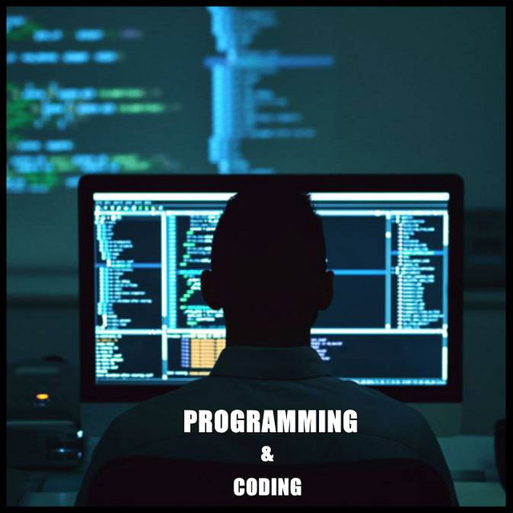

### Hi there, I'm Anubhav Singh - [Portfolio][website] 👋

## I'm a Full Stack Web Developer, Entrepreneur, Tech Savvy and Constant Learner!

- 🔭 I’m currently working as Managing Partner in Alphacode, Goa 💻
- 🌱 I’m currently learning everything 🤣
- 👯 I’m looking to collaborate with other developers on sideline projects.
- 🥅 2020 Goals: Learn | Travelling | Code | Teach
- ⚡ Fun fact: I want to learn Guitar 🎸

### Spotify Playing 🎧

### Connect with me:

[][website]
[][twitter]
[][linkedin]
[][instagram]

 

### Languages and Tools:

[]
[]
[]
[]
[]
[]
[]
[]
[]
[]
[]
[]
[]

 
 

---

### 📕 TECH YUVA - INSTAGRAM DEV COMMUNITY PAGE

<!-- YOUTUBE:START -->
- [Popular Web Development Stack](https://www.instagram.com/p/CDlyOWPBvYt/)
- [Web Designer and Developer)](https://www.instagram.com/p/CDnlwb5BF0R/)
- [2020 Roadmap to learning Web Development](https://www.instagram.com/p/CDofdaGhIk_/)
- [How to talk to clients](https://www.instagram.com/p/CEdWkSwDMz5/)
- [Getting started with HTML](https://www.instagram.com/p/CFG_in3D2kJ/)
<!-- YOUTUBE:END -->

➡️ [more such content...](https://instagram.com/tech.yuva)

---

  
:zap: Recent Github Activity

  
<!--START_SECTION:activity-->
1. 💪 Opened PR [#6](https://github.com//colbyfayock/50-projects-for-react-and-the-static-web/pull/6) in [colbyfayock/50-projects-for-react-and-the-static-web](https://github.com//colbyfayock/50-projects-for-react-and-the-static-web)
2. 🗣 Commented on [#249](https://github.com//abhisheknaiidu/awesome-github-profile-readme/issues/249) in [abhisheknaiidu/awesome-github-profile-readme](https://github.com//abhisheknaiidu/awesome-github-profile-readme)
3. 🗣 Commented on [#249](https://github.com//abhisheknaiidu/awesome-github-profile-readme/issues/249) in [abhisheknaiidu/awesome-github-profile-readme](https://github.com//abhisheknaiidu/awesome-github-profile-readme)
4. 💪 Opened PR [#249](https://github.com//abhisheknaiidu/awesome-github-profile-readme/pull/249) in [abhisheknaiidu/awesome-github-profile-readme](https://github.com//abhisheknaiidu/awesome-github-profile-readme)
5. ❗️ Closed issue [#9](https://github.com//jamesgeorge007/github-activity-readme/issues/9) in [jamesgeorge007/github-activity-readme](https://github.com//jamesgeorge007/github-activity-readme)
<!--END_SECTION:activity-->

  
:zap: Github Stats

  

[website]: https://codeSTACKr.com
[twitter]: https://twitter.com/ASRAnubhav
[instagram]: https://www.instagram.com/anubhav_singh18/
[linkedin]: https://www.linkedin.com/in/anubhavsingh1998/
